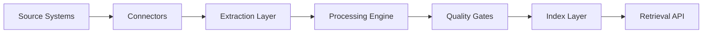

## Overview

This page explains the complete data pipeline: how Peninsula ingests data from your systems, processes it for retrieval, and maintains quality controls throughout.

---

## Ingestion Pipeline

Peninsula's ingestion pipeline transforms raw data from source systems into searchable, retrievable knowledge.

<CardGroup cols={2}>
  <Card title="Connect" icon="plug">
    Establish secure connections to source systems via APIs or exports
  </Card>
  <Card title="Extract" icon="file-export">
    Pull documents, metadata, and relationships from connected systems
  </Card>
  <Card title="Process" icon="gears">
    Parse, structure, and enrich content based on processing depth
  </Card>
  <Card title="Index" icon="database">
    Create retrieval structures for fast, relevant search
  </Card>
</CardGroup>

### Pipeline Flow

---

## Supported File Types

Peninsula processes a wide range of document formats common in legal and business environments.

### Documents

| Format | Extension | Processing |
| --- | --- | --- |
| **Microsoft Word** | `.docx`, `.doc` | Full text extraction, structure preservation |
| **PDF** | `.pdf` | Native extraction + selective OCR |
| **Plain Text** | `.txt` | Direct ingestion |
| **Rich Text** | `.rtf` | Text and formatting extraction |

### Spreadsheets

| Format | Extension | Processing |
| --- | --- | --- |
| **Microsoft Excel** | `.xlsx`, `.xls` | Cell data, formulas, named ranges |
| **CSV** | `.csv` | Structured data parsing |
| **Google Sheets** | via API | Real-time sync |

### Email

| Format | Extension | Processing |
| --- | --- | --- |
| **Outlook** | `.msg` | Headers, body, attachments |
| **Standard Email** | `.eml` | Full message extraction |
| **Mailbox Exports** | `.pst`, `.mbox` | Batch processing |

### Other Formats

| Format | Processing |
| --- | --- |
| **JSON** | Structured data extraction |
| **XML** | Schema-aware parsing |
| **Images** | OCR when text extraction needed |

---

## Common ESOP Documents Processed

Peninsula is optimized for the document types common in ESOP practice:

<AccordionGroup>
  <Accordion title="Plan Documents">
    - ESOP plan documents and amendments
    - Summary Plan Descriptions (SPDs)
    - Trust agreements
    - Adoption agreements
  </Accordion>
  <Accordion title="Valuation Materials">
    - Annual valuation reports
    - Fairness opinions
    - Appraisal summaries
    - Stock price certifications
  </Accordion>
  <Accordion title="Compliance Documents">
    - Form 5500 filings
    - DOL correspondence
    - IRS determination letters
    - Audit reports
  </Accordion>
  <Accordion title="Transaction Documents">
    - Stock purchase agreements
    - Loan documents
    - Board resolutions
    - Closing checklists
  </Accordion>
  <Accordion title="Participant Communications">
    - Enrollment materials
    - Distribution notices
    - Diversification elections
    - Beneficiary designations
  </Accordion>
</AccordionGroup>

---

## Selective Processing Depth

Not all documents require the same level of processing. Peninsula applies selective depth based on document value and retrieval needs.

### Processing Levels

| Level | Name | What It Does | When Used |
| --- | --- | --- | --- |
| **L0** | Catalog | Metadata only for inventory | Low-value or duplicate content |
| **L1** | Parse | Standard text extraction | Most documents |
| **L2** | OCR | Optical character recognition | Scanned documents with poor extraction |
| **L3** | Enrichment | Entity/relation tagging | High-value corpus |

### OCR Policy

<Note>
Peninsula does not OCR all PDFs by default. OCR is applied selectively based on extraction quality and document value.
</Note>

**OCR triggers:**
- Native text extraction quality below threshold
- High-value document with poor readability
- User-requested processing upgrade

**OCR optimization:**
- Page-level OCR preferred over full-document
- Budget prioritized for high-query assets
- Quality scoring after OCR to verify improvement

---

## Data Quality Controls

Quality gates ensure only reliable data enters the retrieval layer.

### Pre-Ingestion Checks

| Check | Purpose |
| --- | --- |
| **Format validation** | Confirm file is readable and not corrupted |
| **Duplicate detection** | Identify and handle duplicate content |
| **Permission verification** | Confirm access rights before processing |
| **Size limits** | Enforce processing limits for oversized files |

### Post-Processing Validation

| Validation | Threshold |
| --- | --- |
| **Extraction quality score** | Minimum 0.7 for indexing |
| **Text coverage** | Minimum 80% of expected content |
| **Metadata completeness** | Required fields populated |
| **Citation readiness** | Source attribution verified |

### Quality Metrics

Peninsula tracks quality metrics across the corpus:

- **Extraction success rate**: Percentage of documents successfully processed
- **OCR accuracy**: Character-level accuracy for OCR'd content
- **Index coverage**: Percentage of corpus available for retrieval
- **Freshness**: Time since last sync for each source

---

## Hybrid Indexing

Peninsula uses a hybrid indexing approach that combines multiple retrieval methods.

### Index Types

<CardGroup cols={3}>
  <Card title="Lexical Index" icon="font">
    Exact and near-exact keyword matching for precise legal terms and citations
  </Card>
  <Card title="Vector Index" icon="brain">
    Semantic similarity for concept-level retrieval and related ideas
  </Card>
  <Card title="Metadata Index" icon="tags">
    Filters by matter, client, date, document type, and confidentiality
  </Card>
</CardGroup>

### Why Hybrid?

| Retrieval Need | Best Index |
| --- | --- |
| Find "IRC 409(p)" exactly | Lexical |
| Find documents about anti-abuse rules | Vector |
| Find 2023 documents for Client X | Metadata |
| Complex query combining all three | Hybrid |

---

## Retrieval Ranking

When you search, Peninsula ranks results by relevance using multiple signals.

### Ranking Factors

| Factor | Weight | Description |
| --- | --- | --- |
| **Query match** | High | How well content matches the query |
| **Source authority** | Medium | Reliability and authoritativeness of source |
| **Recency** | Medium | More recent documents ranked higher |
| **Access frequency** | Low | Documents frequently accessed may be more relevant |
| **User context** | Variable | Matter and workspace context influence ranking |

### Ranking Pipeline

1. **Candidate retrieval**: Hybrid search returns initial candidates
2. **Permission filtering**: Remove results user cannot access
3. **Relevance scoring**: Score each candidate on ranking factors
4. **Diversity injection**: Ensure variety in top results
5. **Final ranking**: Order by combined score

---

## Update Cadence

Peninsula keeps your indexed data current through configurable sync schedules.

### Sync Options

| Cadence | Use Case |
| --- | --- |
| **Real-time** | Critical systems where immediate updates matter |
| **Hourly** | Active document repositories |
| **Daily** | Stable archives and reference materials |
| **Weekly** | Low-change historical content |

### Incremental Updates

After initial ingestion, Peninsula uses incremental sync:

- Only new and modified documents are processed
- Deleted documents are removed from index
- Metadata changes propagate without full reprocessing
- Sync status and health are monitored continuously

---

## Data Pool Sources

Peninsula ingests from a variety of source systems:

### Typical Sources

- Document management systems (NetDocuments, iManage)
- Matter repositories and case management
- Email archives and correspondence
- Shared drives (OneDrive, SharePoint, Google Drive)
- Meeting transcripts and call notes
- CRM and accounting system exports
- External legal reference sources (where licensed)

### Source Configuration

Each source requires:
- Connection credentials and authentication
- Scope definition (what to include/exclude)
- Permission mapping rules
- Sync schedule
- Processing depth defaults

---

## Simple Decision Rule

<Note>
Process deeper only when expected retrieval quality or workflow leverage justifies it, while preserving security, auditability, and portability.
</Note>

This principle guides all processing decisions:
- Start with sufficient processing, not maximum processing
- Upgrade processing depth based on observed retrieval needs
- Prioritize high-value, high-query documents
- Maintain quality gates before expanding scope

## 2) First-Principles Filter: Use / Hold / Exclude

For each incoming asset, we decide:

1. Should this data be included at all?
2. If included, how deeply should it be processed?
3. What retrieval value do we expect from processing it?

Base filter dimensions:

- Relevance to real EBLG workflows
- Citation value and source reliability
- Confidentiality fit and permission enforceability
- Processing cost vs expected utility
- Redundancy (duplicate or superseded content)

## 3) Selective Processing Logic (Efficiency)

Default policy is not maximum processing. Default policy is sufficient processing.

- `L0 Catalog`: metadata only for inventory and lineage
- `L1 Parse`: standard text extraction and structural metadata
- `L2 Selective OCR`: OCR only when extraction quality is poor and file value is high
- `L3 Enrichment`: entity/relation/workflow tagging for high-value corpus

OCR policy:

- Do not OCR all PDFs by default.
- OCR when extraction confidence or usable text coverage falls below threshold.
- Prefer page-level OCR over full-document OCR.
- Prioritize OCR budget on high-query, high-value assets.

## 4) Index Data Question: What It Means

"Index data" means creating retrieval structures that make future queries fast, relevant, and source-grounded.

Peninsula uses a hybrid approach:

- Lexical index: exact and near-exact keyword match
- Vector index: semantic similarity and concept-level retrieval
- Metadata index: filters such as matter, client, date, confidentiality tier, document type

Why hybrid indexing:

- Lexical catches exact legal terms/citations.
- Vector catches conceptually similar language.
- Metadata enforces policy and narrows noise.

## 5) Phased Indexing Strategy

Recommended rollout:

- Baseline index high-value historical corpus first.
- Turn on forward incremental indexing for new content.
- Backfill older/long-tail data only when retrieval analytics justify it.

Why this beats "index everything now":

- Lower initial cost and faster time-to-value.
- Better control over confidentiality and quality.
- Decisions guided by observed query misses instead of assumptions.

## 6) Search -> Retrieval -> Agent Workflow

Request flow:

1. User asks question or launches a workflow.
2. Retriever applies ACL + metadata filters.
3. Hybrid retrieval returns candidate chunks/cards.
4. Ranker assembles citation-backed context.
5. LLM/agent produces draft output with references.
6. Human review gate approves, edits, or rejects.

## 7) What We Can Do with the Data

Once indexed and governed, Peninsula can support:

- Faster drafting of memos, diligence summaries, and transaction analyses
- Cross-matter pattern detection and precedent reuse
- Source-cited Q&A over internal corpus
- Structured exports and reporting for governance and board oversight
- Agent-assisted workflows with explicit human checkpoints

## 8) Simple Decision Rule

Process deeper only when expected retrieval quality or workflow leverage justifies it, while preserving security, auditability, and portability.
