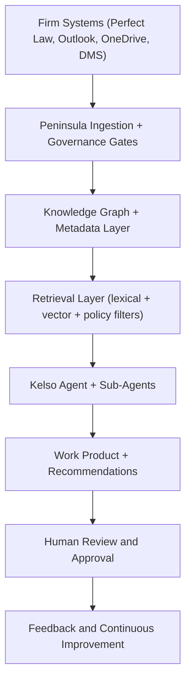

## Executive Definition

Peninsula is a governed legal knowledge platform that turns scattered firm data into a structured, searchable intelligence layer for work product generation and decision support.

It is not just a chatbot wrapper and not just a document repository.

## The Problem Peninsula Solves for EBLG

EBLG has decades of high-value legal expertise distributed across:

- legacy document systems,
- email history,
- partner reasoning that is often not written down.

Without systematization, this knowledge is hard to find, hard to reuse, and vulnerable to partner transition risk.

## The Core Model

Peninsula follows a three-step model:

1. Ingest: connect firm systems and approved external legal sources.
2. Structure: build a knowledge graph and metadata layer over legal concepts, matters, and precedents.
3. Activate: power Kelso and workflows that use this knowledge to produce work product with citations.

## What Makes Peninsula Different from Generic AI

<CardGroup cols={2}>
  <Card title="Firm Grounding" icon="database">
    Uses EBLG's real corpus and institutional memory, not internet-only responses.
  </Card>
  <Card title="Relational Context" icon="layer-group">
    Connects concepts, code sections, precedents, and partner reasoning patterns.
  </Card>
  <Card title="Governed Retrieval" icon="shield-check">
    Enforces matter and role boundaries before retrieval and synthesis.
  </Card>
  <Card title="Operational Output" icon="clipboard-check">
    Produces draft memos, analysis artifacts, and workflow deliverables, not just chat responses.
  </Card>
</CardGroup>

## What Peninsula Is Not

- Not a mandatory replacement for practice management systems.
- Not a billing or trust-accounting engine by default.
- Not an autonomous legal actor that bypasses attorney review.
- Not a black box with undocumented behavior.

## Base Platform vs. Custom Modules

The base platform provides immediate retrieval, drafting, and integration capabilities.
Custom modules add deeper cognitive structure and repeatable firm-specific automation.

| Layer | Role | EBLG impact |
| --- | --- | --- |
| Base Platform | secure ingestion, retrieval, citations, AI access | immediate research and drafting acceleration |
| Knowledge Capture Tools | partner expertise harvesting and structuring | institutional memory retention |
| Document Style Enforcement | firm voice and template consistency | higher quality first drafts with less partner rewrite |
| Outdated Advice Detection | regulatory change monitoring and document impact flags | reduced risk from stale guidance |

## Architecture Snapshot

## Why This Matters for the Manual

Every page in this manual should map back to one of four questions:

1. What is Peninsula doing with our data?
2. How does Kelso produce outputs and why should we trust them?
3. Which controls keep this safe, inspectable, and portable?
4. How does the system improve over time without creating lock-in?
